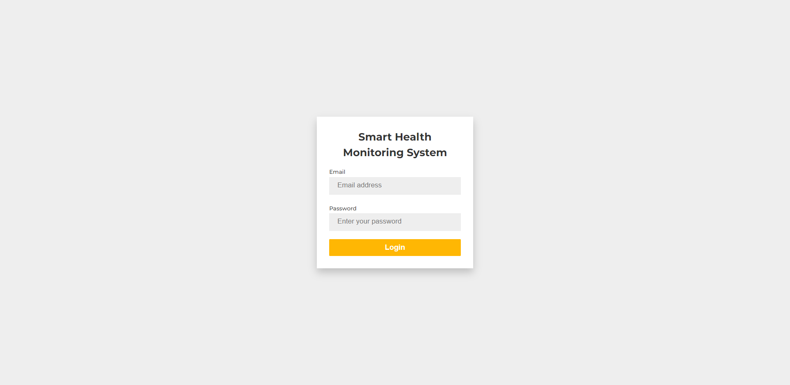
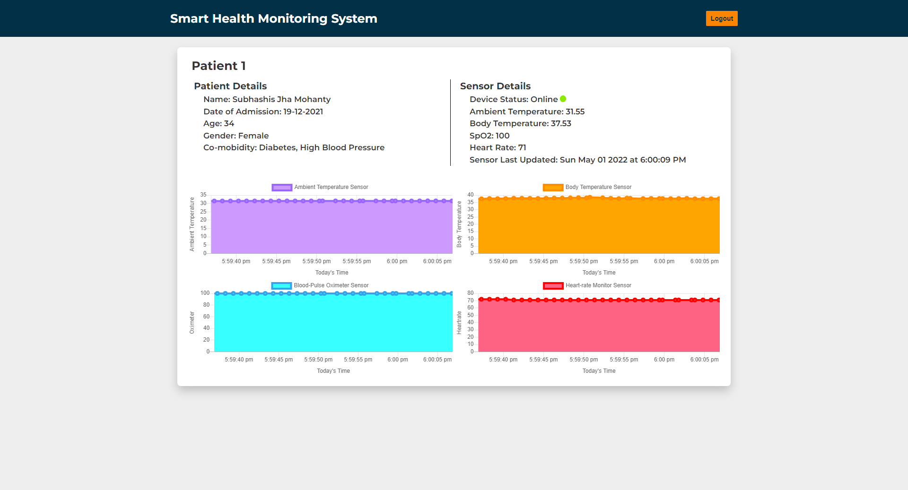
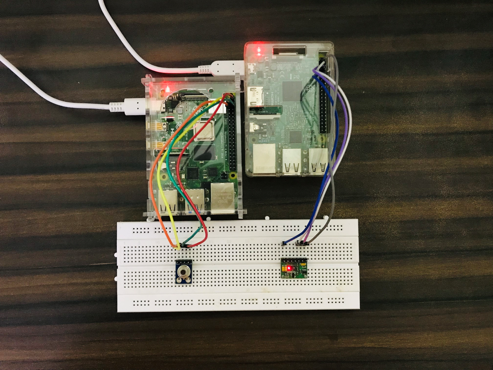
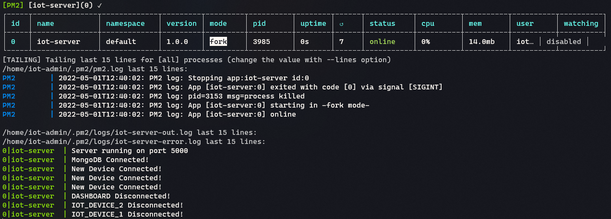

# Smart Health Monitoring System

Health monitoring is a major concern in today's world. Due to a lack of proper health monitoring, patients suffer from serious health issues. There are many devices available nowadays to monitor patients' health over the internet. Health experts are also taking advantage of these smart devices to keep an eye on their patients. With the rise of healthcare technology start-ups, IoT is rapidly revolutionizing the healthcare industry.

In this project, we will create an IoT-based Health Monitoring System that records a patient's heart rate and body temperature. The system also sends an email alert whenever these readings exceed critical values. The lack of assistance for elderly people at home has been reduced due to social changes, and regular health check-ups have become difficult due to COVID-19 situations. This project aims to provide healthcare assistance from home for people who cannot visit doctors regularly and for bedridden individuals.

NodeMCU, a microcontroller unit, will collect data from sensors and transmit it to a cloud platform. Pulse rate and body temperature readings are recorded over Ubidots, allowing patient health monitoring from anywhere in the world via the internet. A panic button will also be attached so that patients can press it in an emergency to send an email/SMS to their relatives.

## Features

* Real-time monitoring of patients
* Customizable monitoring dashboard for doctors and health professionals with a user-friendly interface
* Secure login page for authorized access to patient data and monitoring dashboard
* Patient data analytics and visualization for trend analysis and forecasting
* Remote patient monitoring capabilities for home healthcare services
* Utilizes NodeMCU, an affordable and compact IoT device, for easy and efficient data collection and transmission

## Technologies Used

* ReactJS
* NodeJS
* ExpressJS
* MongoDB
* WebSockets
* NodeMCU
* Python (used in NodeMCU to collect and transmit sensor data)

## Screenshots


*Figure 1: Login Page*


*Figure 2: Monitoring Dashboard*


*Figure 3: IoT Device Setup*


*Figure 4: Server PM2 Overview*

## Installation & Testing

1. Clone the repository:
```sh
git clone https://github.com/username/smart-health-monitoring-system.git
```

2. Navigate to the project directory:
```sh
cd smart-health-monitoring-system
```

3. Navigate to the dashboard directory, install dependencies, and start the frontend:
```sh
cd dashboard && npm install && npm start
```

4. Navigate to the server directory, install dependencies, and start the backend:
```sh
cd ../server && npm install && npm start
```

5. For testing purposes, run the `mockSensor.js` script to feed data into the system:
```sh
cd ../iot-device && node mockSensor.js
```
